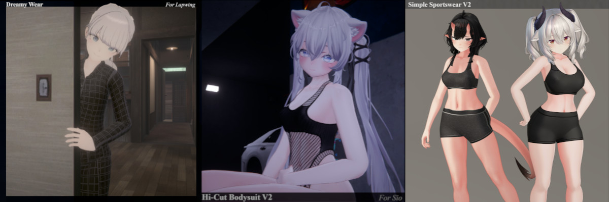

🇬🇧 [English](README.md) | 🇯🇵 [日本語](README.ja.md) | 🇰🇷 [한국어](README.ko.md) | 🇨🇳 [中文](README.zh.md)

---

# こんにちは！

レイアウトの多くはまだ未確定です。すべてが工事中の状態です。もしこの混乱の中に迷い込んでしまった場合は、お気軽にご連絡ください！

^ *📷 Enjoy a picture of me* ^

---

# はじめに

このサイトは、私が作成したVRChatアセットに関するドキュメント、およびアバターのカスタマイズに関する一般的なチュートリアルやガイドを掲載するためのものです。特に初心者の方にとって、アバターを個性的にするための助けになるはずです。

先に進む前に、[免責事項](docs/0.md) をお読みください。ありがとうございます！

---

# ディレクトリ

## 一般ガイド

1. [Essential Setup](docs/1.md)
2. [First Steps](docs/2.md)
3. [Examples](docs/3.md)
4. [Reference](docs/4.md)
5. [FAQ](docs/5.md)
6. [Credits](docs/6.md)
7. [Notes](docs/7.md)

## 私の製品

^ *ドキュメントおよび上級カスタマイズのヒントはこちら* ^

---

## その他の情報:  

**お問い合わせはこちら！:** https://x.com/OKKeissen

**Boothストアページ:** https://keissen.booth.pm/

**私のリンク一覧！:** https://beacons.ai/keissen
